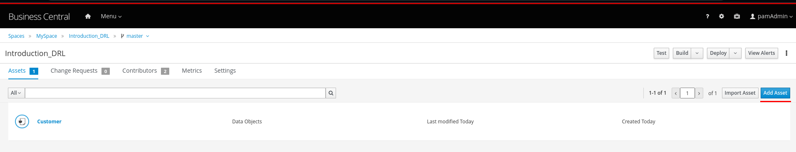
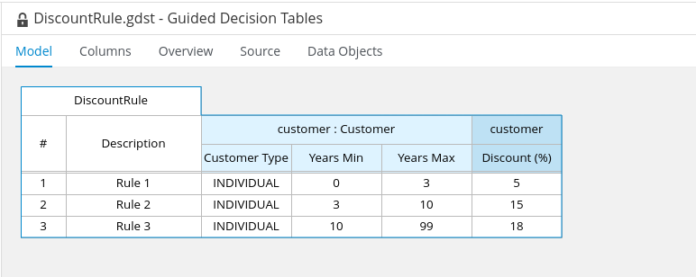

Introdução a DRL (Drools Rule Language)
===========================

Esse é um laboratório para exercitar conceitos e fundamentos de Bussiness Rules Management System. A regra utilizará DRL interpretada com uma Decision Table.

## Objetivos

- Criar um projeto.
- Criar um Objeto
- Criar uma regra de negócio.
- Utilizando Decision Table
- Implementar condições.
- Executar a regra via Rest

## Pré requisitos

- Um ambiente RHPAM disponível e funcional.

Premissas do problema
=====================

Este laboratório terá o objetivo de criar uma regra de negócio que avaliará a porcentagem de desconto baseado em características do cliente.

- As informações do cliente será passada para a regra.
- Caso o cliente seja do tipo `INDIVIDUAL` e tenha menos do que 3 anos de fidelidade, o desconto oferecido será de **5%**.
- Caso o cliente seja do tipo `INDIVIDUAL` e tenha mais do que 3 anos de fidelidade e menos do que 10 anos fidelidade, o desconto oferecido será de **15%**.
- Caso o cliente seja do tipo `INDIVIDUAL` e tenha mais do que 10 anos de fidelidade e menos do que 99 anos fidelidade, o desconto oferecido será de **18%**.
- Caso o cliente seja do tipo `BUSINESS` não importa o tempo de fidelidade, o desconto oferecido será de **20%**.


Criação do projeto
-------------------

Vamos criar um projeto para a nossa regra de negócio.

1. Dentro de algum **Space** no Business Central clique em **Add Project** para criar um novo projeto.


2. No campo **Name** acresente acresente o valor `Introduction_DRL` e clique em **Add** para criar o projeto.


Criação Assets (Data Object)
--------------

1. Na página principal do projeto recém criado, clique em **Add Asset** para criar um novo asset.


2. Na página de assets disponíveis, localize **Data Object** (uma das primeiras opções).


3. No campo **Data Object** preencha com `Customer`. Garanta que no campo **Package** esteja a opção `com.myspace.introduction_drl`. Em seguida clique em **Ok**.


4. Crie os atributos do Objeto. Clique no botão **add field** para adicionar um atributo.


5. Crie o atributo e clique em **Create and continue** para adicionar um novo atributo.

  * Atributos:

<table>
<colgroup>
<col style="width: 33%" />
<col style="width: 33%" />
<col style="width: 33%" />
</colgroup>
<tbody>
<tr class="odd">
<td><p>Id</p></td>
<td><p>Label</p></td>
<td><p>Type</p></td>
</tr>
<tr class="even">
<td><p>customerType</p></td>
<td><p> </p></td>
<td><p>String</p></td>
</tr>
<tr class="odd">
<td><p>years</p></td>
<td><p> </p></td>
<td><p>Integer</p></td>
</tr>
</tr>
<tr class="even">
<td><p>discount</p></td>
<td><p> </p></td>
<td><p>Integer</p></td>
</tr>
</tbody>
</table>

  * Exemplo do primeiro atributo:


  * Ao final o objeto terá este resultado:


  * Clique em **Save** no canto superior direito.

Criação Assets (Guided Decision Table)
--------------

1. Na página principal do projeto, clique em **Add Asset** para criar um novo asset.



2. Na página de assets disponíveis, localize **Guided Decision Table** (uma das primeiras opções).


3. No campo **Guided Decision Table** preencha com `DiscountRule` e garanta que no campo **Package** esteja a opção `com.myspace.introduction_drl`. Não altere nenhuma outra opção e em seguida clique em **Ok**.


4. Vamos criar as condições da regra. No canto superior direito localize a opção **Insert** e clique em **Insert colunm**.


5. Selecione a opção **Add a Condition** e em seguida clique em **Next**.


6. Clique em **Create a new Fact Pattern**, em seguida no campo **Binding** insira o valor `customer` e confime no **Ok** e o popup fechará. Ao final clique em **Next**.


7. Selecione a opção **Literal Value** e em seguida clique em **Next**.


8. No campo **Field** selecione o atributo `customerType` e em seguida clique em **Next**.


9. No campo **Operator** selecione a opção `equal to` e em seguida clique em **Next**.


10. Deixe os campos em branco e apenas clique em **Next**.


11. No campo **Header (description)** insira o valor `Customer Type` e clique em **Finish**.


12. Acrescente outra coluna. No canto superior direito localize a opção **Insert** e clique novamente em **Insert colunm**.


13. Selecione a opção **Add a Condition** e em seguida clique em **Next**.


14. Agora no campo **Pattern**, selecione a opção `Customer [customer]` que foi criada nos passos ateriores. Ao final clique em **Next**.


15. Selecione a opção **Literal Value** e em seguida clique em **Next**.


16. No campo **Field** selecione o atributo `years` (novamente) e em seguida clique em **Next**.


17. No campo **Operator** selecione a opção `greater than` e em seguida clique em **Next**.


18. Deixe os campos em branco e apenas clique em **Next**.


19. No campo **Header (description)** insira o valor `Years Min` e clique em **Finish**.


20. Acrescente outra coluna. No canto superior direito localize a opção **Insert** e clique novamente em **Insert colunm**.


21. Selecione a opção **Add a Condition** e em seguida clique em **Next**.


22. Agora no campo **Pattern**, selecione a opção `Customer [customer]` que foi criada nos passos ateriores. Ao final clique em **Next**.


23. Selecione a opção **Literal Value** e em seguida clique em **Next**.


24. No campo **Field** selecione o atributo `years` e em seguida clique em **Next**.


25. No campo **Operator** selecione a opção `less than or equal to` e em seguida clique em **Next**.


26. Deixe os campos em branco e apenas clique em **Next**.


27. No campo **Header (description)** insira o valor `Years Max` e clique em **Finish**.


28. Acrescente outra coluna. No canto superior direito localize a opção **Insert** e clique novamente em **Insert colunm**.


29. Selecione a opção **Set the value of a field** e em seguida clique em **Next**.


30. Agora no campo **Pattern**, selecione a opção `Customer [customer]` que foi criada nos passos ateriores. Ao final clique em **Next**.


31. No campo **Field** selecione o atributo `discount` e em seguida clique em **Next**.


32. Deixe os campos em branco e apenas clique em **Next**.


33. No campo **Header (description)** insira o valor `Discount (%)` e clique em **Finish**.


34. Ao final o resultado será:


Criação Condições (regras)
--------------

1. Vamos acrescentar as condições da regra, para isso no canto superior direito localize a opção **Insert** e clique novamente em **Append row**.


2. Acrescente a primeira regra com os valores abaixo:

<table>
<colgroup>
<col style="width: 33%" />
<col style="width: 33%" />
<col style="width: 33%" />
</colgroup>
<tbody>
<tr class="odd">
<td><p>Description</p></td>
<td><p>Customer Type</p></td>
<td><p>Years Min</p></td>
<td><p>Years Max</p></td>
<td><p>Discount (%)</p></td>
</tr>
<tr class="even">
<td><p>Rule 1</p></td>
<td><p>INDIVIDUAL</p></td>
<td><p>0</p></td>
<td><p>3</p></td>
<td><p>5</p></td>
</tbody>
</table>


3. Vamos acrescentar outra condição da regra, para isso no canto superior direito localize a opção **Insert** e clique novamente em **Append row**.


4. Acrescente a segunda regra com os valores abaixo (não precisa repetir os valores das anteriores, apenas acrescente embaixo da regra anterior):

<table>
<colgroup>
<col style="width: 33%" />
<col style="width: 33%" />
<col style="width: 33%" />
</colgroup>
<tbody>
<tr class="odd">
<td><p>Description</p></td>
<td><p>Customer Type</p></td>
<td><p>Years Min</p></td>
<td><p>Years Max</p></td>
<td><p>Discount (%)</p></td>
</tr>
<tr class="even">
<td><p>Rule 2</p></td>
<td><p>INDIVIDUAL</p></td>
<td><p>3</p></td>
<td><p>10</p></td>
<td><p>15</p></td>
</tbody>
</table>


5. Vamos acrescentar outra condição da regra, para isso no canto superior direito localize a opção **Insert** e clique novamente em **Append row**.


6. Acrescente a terceira regra com os valores abaixo (não precisa repetir os valores das anteriores, apenas acrescente embaixo da regra anterior):

<table>
<colgroup>
<col style="width: 33%" />
<col style="width: 33%" />
<col style="width: 33%" />
</colgroup>
<tbody>
<tr class="odd">
<td><p>Description</p></td>
<td><p>Customer Type</p></td>
<td><p>Years Min</p></td>
<td><p>Years Max</p></td>
<td><p>Discount (%)</p></td>
</tr>
<tr class="even">
<td><p>Rule 3</p></td>
<td><p>INDIVIDUAL</p></td>
<td><p>10</p></td>
<td><p>99</p></td>
<td><p>18</p></td>
</tbody>
</table>



7. Vamos acrescentar outra condição da regra, para isso no canto superior direito localize a opção **Insert** e clique novamente em **Append row**.


8. Acrescente a quarta regra com os valores abaixo (não precisa repetir os valores das anteriores, apenas acrescente embaixo da regra anterior):

<table>
<colgroup>
<col style="width: 33%" />
<col style="width: 33%" />
<col style="width: 33%" />
</colgroup>
<tbody>
<tr class="odd">
<td><p>Description</p></td>
<td><p>Customer Type</p></td>
<td><p>Years Min</p></td>
<td><p>Years Max</p></td>
<td><p>Discount (%)</p></td>
</tr>
<tr class="even">
<td><p>Rule 4</p></td>
<td><p>BUSINESS</p></td>
<td><p> </p></td>
<td><p> </p></td>
<td><p>20</p></td>
</tbody>
</table>


9. Ao final clique em save no canto superior direito.


Deploy do Projeto
===============================

Faça o build e deploy do projeto.

### Pré Requisito

- Passo anterior de [Criação da regra](#criação-assets-guided-decision-table)

1. Na página inicial do projeto clique em **Deploy**.


2. A mensagem que espera-se ver é de sucesso:


Testar o Projeto
===============================

Para testar apenas uma regra que não esteja inserida em um processo, precisaremos iniciar via Rest. Para isso vamos até o Swagger do **Kie-Server** para executa-la.

1. Caso você esteja fazendo o laboratório com o RHPAM local, abra uma nova página no seu browser no endereço `http://localhost:8080/kie-server/docs`

  * Caso você esteja utilizando o RHPAM no Openshift que está na Cloud. No menu lateral esquedo vá até **Topology** e localize o **Kie-Server** e clique em **Open Url**. Abrirá uma nova aba no seu navegador, acrescente ao final da URL `/docs` para abrir o Swagger.

2. Essa será a visão inicial do Swagger:


3. Localize o tópico **Kie session assets** e em seguida clique no único endpoint deste tópico.


4. Clique em **Try it out**. No campo **containerId** insira o seguinte valor `Introduction_DRL_1.0.0-SNAPSHOT`

5. No campo **Body** acrescente o seguinte valor:

```json
{
  "commands": [
    {
      "insert": {
        "out-identifier": "obj",
        "object": {
          "com.myspace.introduction_drl.Customer": {
            "customerType": "INDIVIDUAL",
            "years": 1
          }
        }
      }
    },
    {
      "fire-all-rules": {}
    }
  ]
}
```


* Garanta que o **Content-Type** seja `application/json`
* Clique em **Execute** para executar a chamada Rest Via Swagger.
* Com essas informções irá disparar a primeira regra da Decision Table.

6. Caso aparece um popup solicitando login, utilize o seu login e senha padrão do RHPAM.


7. O resultado esperado é que o código retorne `200` e na resposta da chamada que você consiga localizar os valores passados para o objeto e a resposta no atributo `discount`.


8. Tente novamente porém alterando os valores do JSON no passo de número `5` e verifique o resultado da regra.

Projeto Completo
===============================

Caso queira ver o resultado final, apenas importe esse repositório no **RHPAM** e faça o deploy.